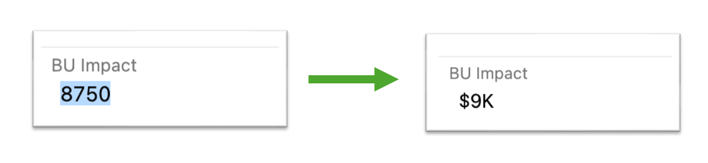

# Cost Roll-Up Widget for Azure DevOps

[](https://marketplace.visualstudio.com/items?itemName=deenuy.ado-cost-rollup-widget)
[](https://github.com/deenuy/ado-cost-rollup-widget/stargazers)
[](https://github.com/deenuy/ado-cost-rollup-widget/actions/workflows/ci.yml)
[](LICENSE.md)
[](CONTRIBUTING.md)

An Azure DevOps dashboard widget that aggregates work items by any string-like field and sums any numeric field, displayed as formatted currency — `$2K`, `€1.5M`, `₹245K`. Group by team, area, portfolio, status, owner — anything you can pick in a query column. Sum budgets, estimated costs, business impact — anything Integer or Double.



## Why

Azure DevOps dashboards show what work is happening — counts, status, burndown — but provide no built-in way to roll up a numeric field across a query and display the total. Teams tracking budgets, cost estimates, or business impact end up exporting work items to Excel or building Power BI reports just to see totals.

This widget fills that gap. Pick a saved query, pick a field to group by, pick a numeric field to sum. The widget aggregates work items into buckets and renders the totals as formatted currency, with item counts and percentage of the grand total — all inline on the dashboard.

## Features

- **Uses your existing queries.** No separate query language. Whatever's in the query's selected columns becomes the configurable fields.
- **Type-aware field pickers.** Group-by dropdown shows only string, identity, tree-path, boolean, and picklist columns. Aggregate dropdown shows only Integer and Double. Invalid combinations are impossible to configure.
- **Multi-currency.** USD, EUR, GBP, INR, JPY, CAD, AUD, BRL, ZAR, and more. ISO 4217 codes.
- **Two format styles.** `compact` (`$2K`, `$1.5M`) for at-a-glance dashboards, or `full` (`$2,000`, `$1,500,000`) when precision matters.
- **Native styling.** Built with Fluent UI conventions to blend with Azure DevOps's built-in widgets.
- **Efficient at scale.** Streams work items in batches of 200, aggregates via a Map, never materializes the full result set. Handles 10K+ work items without blocking the UI.
- **Zero telemetry.** No external network calls. Scope: `vso.work` (read work items the user already has access to).

## Quick start

### Install from the marketplace

1. Visit the [marketplace listing](https://marketplace.visualstudio.com/items?itemName=deenuy.ado-cost-rollup-widget).
2. Click **Get it free** and select your Azure DevOps organization.

### Add the widget to a dashboard

1. Open any team dashboard in Azure DevOps.
2. Click **Edit** → **Add a widget** → search for **Cost Roll-Up** → **Add**.
3. Click the widget's gear icon → **Configure**.
4. Set the options:

   | Option | Required | Default | Notes |
   |---|---|---|---|
   | **Query** | yes | — | Any saved query under Shared Queries or My Queries. |
   | **Group by** | yes | — | Picks one of the query's string-like columns (team, area, status, owner, etc.). |
   | **Group column header** | no | field name | Friendly label for the group column. |
   | **Aggregate** | yes | — | Picks one of the query's Integer or Double columns (cost, impact, budget). |
   | **Aggregate column header** | no | field name | Friendly label for the total column. |
   | **Currency** | no | `USD` | ISO 4217 code. Unknown codes fall back to `<CODE> 2K`. |
   | **Format** | no | `compact` | `compact` = `$2K`, `full` = `$2,000` |
   | **Max rows** | no | `0` | `0` shows all groups. Set to limit long lists. |

5. Save. The widget renders the grouped totals immediately.

### Typical uses

- Total budget by business unit
- Estimated versus actual cost by team
- Business impact rolled up by portfolio area
- Project cost by status (Active, On Hold, Completed)
- Funding distribution across initiatives

### Format examples

| Value | Compact (USD) | Full (USD) | Compact (EUR) |
|---|---|---|---|
| 500 | `$500` | `$500` | `€500` |
| 2,000 | `$2K` | `$2,000` | `€2K` |
| 245,678 | `$246K` | `$245,678` | `€246K` |
| 1,500,000 | `$1.5M` | `$1,500,000` | `€1.5M` |
| 12,000,000 | `$12M` | `$12,000,000` | `€12M` |
| -50,000 | `-$50K` | `-$50,000` | `-€50K` |

## Build from source

```bash
git clone https://github.com/deenuy/ado-cost-rollup-widget.git
cd ado-cost-rollup-widget
npm install
npm run typecheck     # tsc --noEmit
npm run build         # production bundle in dist/
make package          # builds + produces a .vsix in releases/
```

### Test locally

1. Upload the `.vsix` privately: **Marketplace → Manage → Upload extension → Share with your org**.
2. Install it in a test Azure DevOps organization.
3. Add the widget to a dashboard per the quick-start steps above.

### Publish to the marketplace

```bash
# One-time: get a PAT from https://dev.azure.com/<your-org>/_usersSettings/tokens
# Scope: Marketplace (publish)
npx tfx login --service-url https://marketplace.visualstudio.com --token <YOUR_PAT>

# Bump the version in vss-extension.json, then:
npm run publish:marketplace
```

## How it works

A quick mental model: the widget is a TypeScript module registered with the Azure DevOps dashboard host. When the dashboard renders, the host instantiates the widget inside an iframe, hands it the saved configuration, and the widget executes the configured query, fetches work items in batches, aggregates them by the configured group-by field, sums the configured aggregate field, and renders a table.

The configuration pane is a separate iframe with its own bundle. It reads the user's queries via the work item tracking SDK, joins the query's columns with the project's field type metadata, and filters the group-by and aggregate dropdowns to the appropriate types — string-like fields for grouping, numeric fields for summing.

Field type filtering enforces correctness at config time, so invalid combinations can't be saved. No runtime validation, no error states for "wrong field type" — the dropdowns simply don't offer them.

## Compatibility

| Component | Version |
|---|---|
| Azure DevOps Services | All versions |
| Azure DevOps Server | 2018+ (TFS 15.0+) |
| Browsers | All modern browsers (Chrome 90+, Edge 90+, Firefox 88+, Safari 14+) |
| Node (for building from source) | 18+ |

## Contributing

Contributions welcome. This is a small, focused extension — issues, bug reports, and PRs are all appreciated.

- **Read [CONTRIBUTING.md](CONTRIBUTING.md)** for development setup, code style, and PR guidelines.
- **Open an issue** before submitting non-trivial PRs so we can discuss the design first.

Good first issues:

- Add more currency symbols to `src/scripts/formatCurrency.ts` (`SYMBOLS` map).
- Add a sort-order toggle (currently descending by sum; ascending and alphabetical would be useful).
- Add a "click row to open filtered query" interaction.
- Add accessibility improvements (ARIA labels for sortable columns, keyboard navigation).
- Translate the README and marketplace overview to other languages.

## Roadmap

Not committed, just possibilities:

- **Drill-down on row click.** Open the source query filtered to the selected group.
- **Sort options.** Toggle between sum descending, count descending, and alphabetical.
- **Bar chart view.** Toggle between table and horizontal bar visualization for the same data.
- **Locale-specific abbreviations.** Lakhs and crores for INR (`₹2.5L`, `₹1.2Cr`).
- **Multi-aggregate.** Sum two numeric fields side-by-side (e.g., Estimated vs Actual).
- **CSV export.** Download the aggregated table.

## Security

This widget runs in an Azure DevOps-provided iframe with the `vso.work` scope. It reads only the fields needed for the configured query and aggregation. There are no external network calls, no telemetry, no analytics. If you find a security issue, please email <your-security-email@example.com> rather than opening a public issue.

## License

[MIT](LICENSE.md). Use it, fork it, ship it.

## Acknowledgements

Built on the [vss-web-extension-sdk](https://github.com/Microsoft/vss-web-extension-sdk).