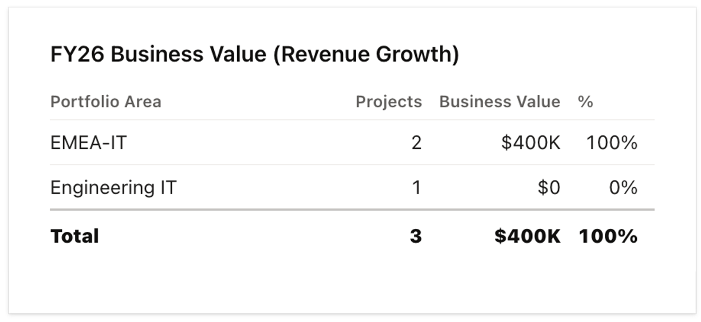
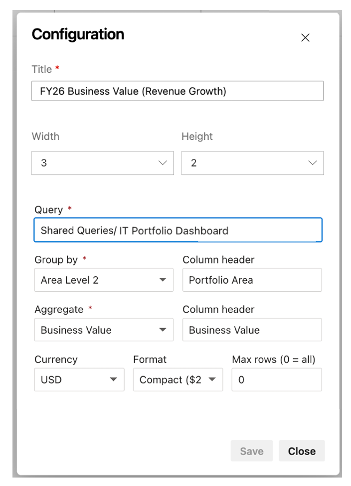

# Cost Roll-Up Widget for Azure DevOps

[](https://marketplace.visualstudio.com/items?itemName=deenuy.ado-cost-rollup-widget)
[](https://github.com/deenuy/ado-cost-rollup-widget/stargazers)
[](https://github.com/deenuy/ado-cost-rollup-widget/actions/workflows/ci.yml)
[](LICENSE.md)
[](CONTRIBUTING.md)

A lightweight Azure DevOps dashboard widget that aggregates work items by any groupable field and sums any numeric field — rendered as formatted currency (`$2K`, `€1.5M`, `₹245K`). Designed for IT portfolio managers, PMOs, and engineering leaders who need financial roll-ups without leaving the dashboard.



---

## The Problem

Azure DevOps dashboards are great at showing work status — counts, burndowns, velocity — but offer no built-in way to **roll up a numeric field** across a query. Teams tracking budgets, cost estimates, or business impact resort to Excel exports or Power BI reports just to see totals.

## The Solution

**Cost Roll-Up** fills that gap. Point it at a saved query, choose a field to group by, and a numeric field to sum. The widget aggregates work items into groups and renders totals as formatted currency — with item counts and percentage of the grand total — all inline on the dashboard.

No external services. No telemetry. No data leaves your Azure DevOps tenant.

---

## Features

| Feature | Description |
|---|---|
| **Query-driven** | Uses your existing saved queries. No separate query language to learn. |
| **Type-aware field pickers** | Group-by shows only string, identity, tree-path, boolean, and picklist columns. Aggregate shows only Integer and Double fields. Invalid combinations are impossible to configure. |
| **Multi-currency** | USD, EUR, GBP, INR, JPY, CAD, AUD, BRL, ZAR, and more (ISO 4217). |
| **Two display formats** | `Compact` (`$2K`, `$1.5M`) for at-a-glance views, or `Full` (`$2,000`, `$1,500,000`) when precision matters. |
| **Native styling** | Built with Fluent UI conventions to blend seamlessly with Azure DevOps built-in widgets. |
| **Efficient at scale** | Streams work items in batches of 200, aggregates via a Map, never materializes the full result set. Handles 10K+ items without blocking the UI. |
| **Zero telemetry** | No external network calls. Scope: `vso.work` (read-only access to work items the user already has access to). |

---

## Quick Start

### 1. Install

Visit the https://marketplace.visualstudio.com/items?itemName=deenuy.ado-cost-rollup-widget → **Get it free** → select your Azure DevOps organization.

### 2. Add to Dashboard

1. Open any team dashboard → **Edit** → **Add a widget**.
2. Search for **Cost Roll-Up** → **Add**.
3. Select the widget gear icon → **Configure**.

### 3. Configure



| Option | Required | Default | Description |
|---|---|---|---|
| **Title** | yes | — | Display title shown on the widget header (e.g., `FY26 Business Value (Revenue Growth)`). |
| **Width / Height** | no | `3 x 2` | Widget dimensions on the dashboard grid. |
| **Query** | yes | — | Any saved query under Shared Queries or My Queries. |
| **Group by** | yes | — | A string-like column from the query (e.g., Area Path, Team, Status, Owner). |
| **Group column header** | no | field name | Friendly label for the group column (e.g., `Portfolio Area`). |
| **Aggregate** | yes | — | An Integer or Double column from the query (e.g., Business Value, Estimated Cost). |
| **Aggregate column header** | no | field name | Friendly label for the aggregate column (e.g., `Business Impact`). |
| **Currency** | no | `USD` | ISO 4217 currency code. Unknown codes fall back to `<CODE> 2K`. |
| **Format** | no | `Compact` | `Compact` = `$2K` / `Full` = `$2,000`. |
| **Max rows** | no | `0` | `0` = show all groups. Set a limit for long lists. |

### 4. Save and View

The widget renders grouped totals immediately — no refresh needed.

---

## Use Cases

- **Budget roll-up by business unit** — see total planned spend per area.
- **Business impact by portfolio area** — aggregate cost reduction, revenue growth, or efficiency gains.
- **Project cost by status** — compare Active, On Hold, and Completed investment.
- **Estimated vs. actual cost by team** — track forecast accuracy.
- **Funding distribution across initiatives** — visualize allocation at a glance.

---

## Format Reference

| Value | Compact (USD) | Full (USD) | Compact (EUR) |
|---|---|---|---|
| 500 | `$500` | `$500` | `€500` |
| 2,000 | `$2K` | `$2,000` | `€2K` |
| 245,678 | `$246K` | `$245,678` | `€246K` |
| 1,500,000 | `$1.5M` | `$1,500,000` | `€1.5M` |
| 12,000,000 | `$12M` | `$12,000,000` | `€12M` |
| -50,000 | `-$50K` | `-$50,000` | `-€50K` |

---

## Build from Source

```bash
git clone https://github.com/deenuy/ado-cost-rollup-widget.git
cd ado-cost-rollup-widget
npm install
npm run typecheck     # tsc --noEmit
npm run build         # production bundle → dist/
make package          # build + produce .vsix → releases/
````

### Test Locally

1.  Upload the `.vsix` privately: **Marketplace → Manage → Upload extension → Share with your org**.
2.  Install it in a test Azure DevOps organization.
3.  Add the widget to a dashboard per the Quick Start steps above.

### Publish to Marketplace

```bash
# One-time setup: generate a PAT from https://dev.azure.com/<your-org>/_usersSettings/tokens
# Scope: Marketplace (publish)
npx tfx login --service-url https://marketplace.visualstudio.com --token <YOUR_PAT>

# Bump the version in vss-extension.json, then:
npm run publish:marketplace
```

***

## How It Works

The widget is a TypeScript module registered with the Azure DevOps dashboard host. When the dashboard loads:

1.  **Host** instantiates the widget inside an iframe and passes the saved configuration.
2.  **Widget** executes the configured query via the Work Item Tracking REST API.
3.  **Batching** — work items are fetched in pages of 200, never materializing the full set.
4.  **Aggregation** — items are grouped by the configured field and summed via a Map.
5.  **Rendering** — a styled table displays group labels, item counts, formatted totals, and percentage of the grand total.

The **configuration pane** is a separate iframe bundle. It reads the user's saved queries via the SDK, joins query columns with project field-type metadata, and filters dropdowns to valid types only — string-like fields for grouping, numeric fields for summing. Invalid combinations cannot be saved.

***

## Compatibility

| Component             | Supported Versions                            |
| --------------------- | --------------------------------------------- |
| Azure DevOps Services | All versions                                  |
| Azure DevOps Server   | 2018+ (TFS 15.0+)                             |
| Browsers              | Chrome 90+, Edge 90+, Firefox 88+, Safari 14+ |
| Node.js (build only)  | 18+                                           |

***

## Roadmap

Not committed — community input welcome:

*   **Drill-down on row click** — open the source query filtered to the selected group.
*   **Sort options** — toggle between sum descending, count descending, and alphabetical.
*   **Bar chart view** — toggle between table and horizontal bar visualization.
*   **Locale-specific abbreviations** — lakhs and crores for INR (`₹2.5L`, `₹1.2Cr`).
*   **Multi-aggregate** — sum two numeric fields side-by-side (e.g., Estimated vs. Actual).
*   **CSV export** — download the aggregated table.

***

## Contributing

Contributions welcome. This is a small, focused extension — issues, bug reports, and PRs are all appreciated.

*   Read **CONTRIBUTING.md** for development setup, code style, and PR guidelines.
*   **Open an issue** before submitting non-trivial PRs so we can discuss the approach first.

### Good First Issues

*   Add currency symbols to `src/scripts/formatCurrency.ts` (`SYMBOLS` map).
*   Add a sort-order toggle (ascending, alphabetical).
*   Add "click row to open filtered query" interaction.
*   Improve accessibility (ARIA labels, keyboard navigation).
*   Translate the README and marketplace overview.

***

## Security

This widget runs inside an Azure DevOps-provided iframe with the `vso.work` scope. It reads only the fields required for the configured query and aggregation. No external network calls, no telemetry, no analytics.

If you discover a security issue, please email <your-security-email@example.com> rather than opening a public issue.

***

## License

LICENSE.md — use it, fork it, ship it.

## Acknowledgements

Built on the <https://github.com/Microsoft/vss-web-extension-sdk>.